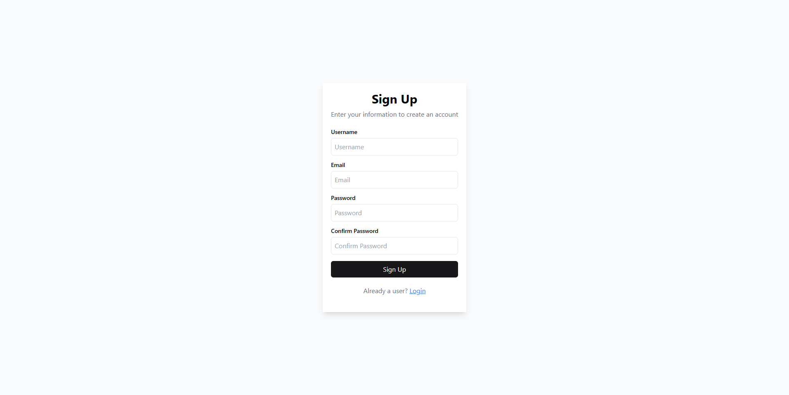
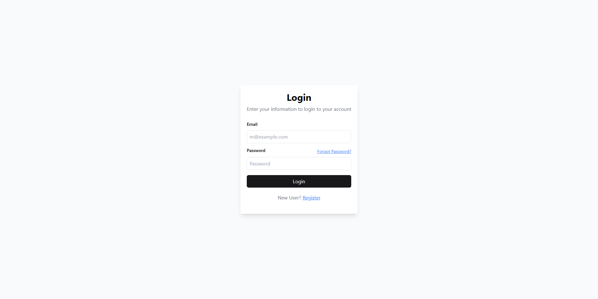
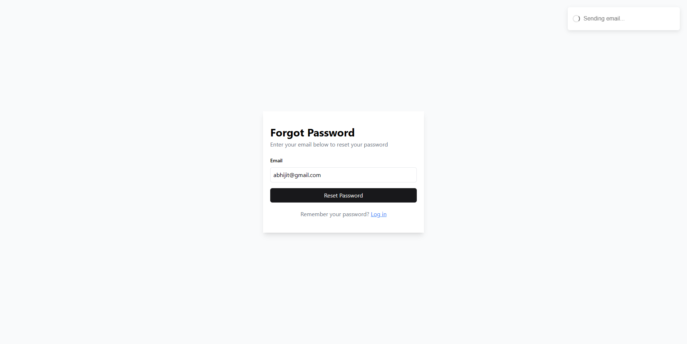
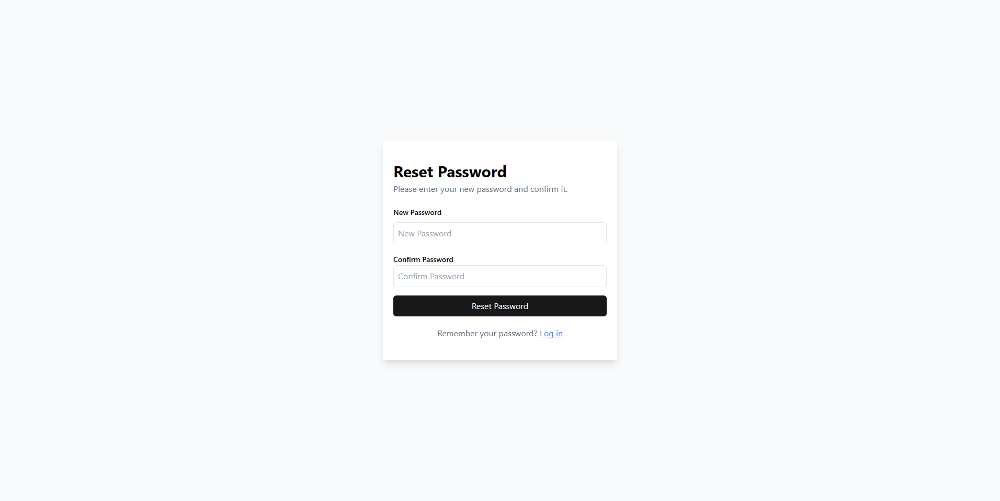
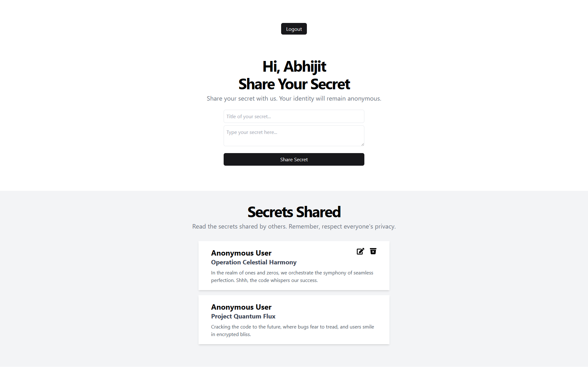

# SecretSphere: MERN Stack Secrets App

## Overview

This MERN (MongoDB, Express.js, React.js, Node.js) stack project aims to provide a platform for users to share secrets anonymously. It includes key functionalities.

## 📹 Watch the Demo [SecretSphere Demo](https://youtu.be/OM358TpRwMo)

## Key Functionalities

### 1. User Authentication System

- Implemented a secure authentication system that included user registration, login, and password recovery functionalities using JWT Tokens.

### Sign Up Page

### Login Page

### Forgot Password Page

### Reset Password Page

### 2. Secrets Posting Section

- Designed a user-friendly home screen featuring a section for posting secrets.
- Allows each user to share one secret message.
- Displays secrets shared by other users without revealing the identity of the person sharing it.

### Home Page

### 3. Responsiveness Across Devices

- Ensured the application was responsive on various devices such as tablets, desktops, and phones.
- Utilized front-end frameworks Tailwind CSS to achieve responsiveness.

## Technologies Used

- MongoDB
- Express.js
- React.js
- Node.js
- Front-end framework: Tailwind CSS
- JWT (Json Web Token) for authentication
- Bcrypt for hashing password
- Nodemailer for sending mail
- Zod for backend validation

## Setup Instructions

1. Clone the repository.
2. Navigate to the project directory Frontend/Backend.

**Client Side:**

- Install dependencies using `npm install`.
- Run `npm run dev` to start the react frontend.

**Server Side:**

- Install dependencies using `npm install`.
- Set up environment variables in Backend (Provided .env.example file)
- Run `npm start` to start the development server with Nodemon.
- Run `mongod --dbpath <data location>` to start mongodb database locally, don't forget to create the empty data folder before.

## Usage

1. Visit the deployed [website](https://affworld-assignment-1.onrender.com/) or run locally by following setup instruction given above.
2. Register or log in to the application.
3. Explore the home screen to post and view secrets.
4. Enjoy the anonymous sharing experience!
5. Forgot/Reset Password feature.
